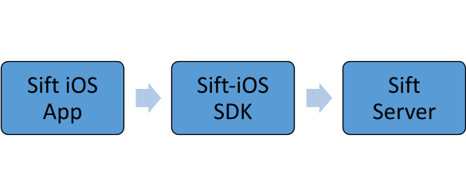
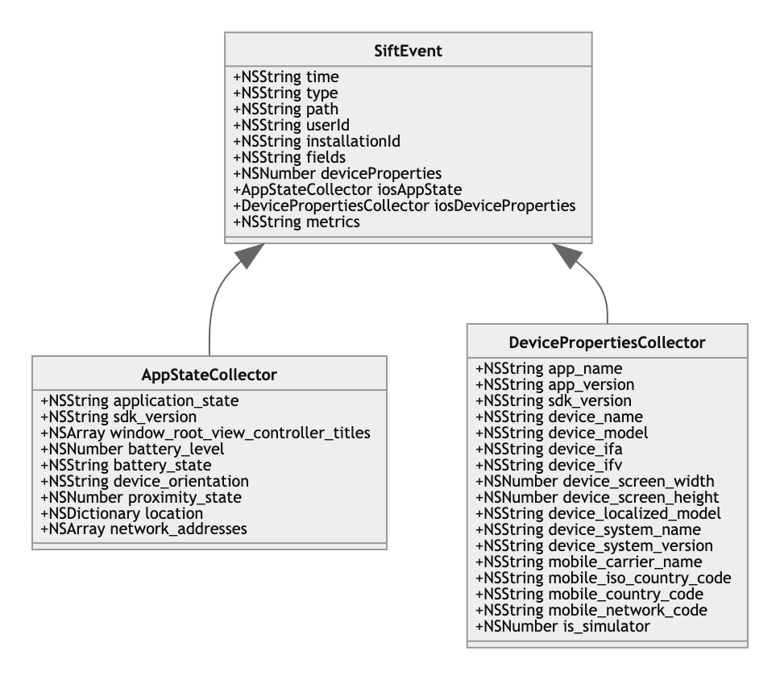
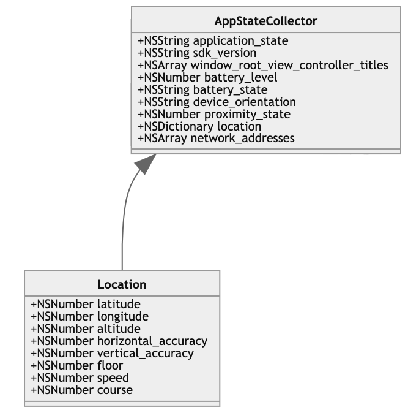
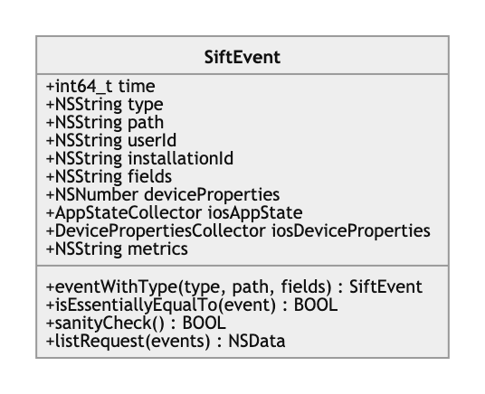
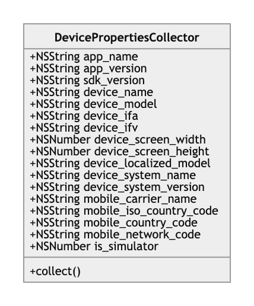
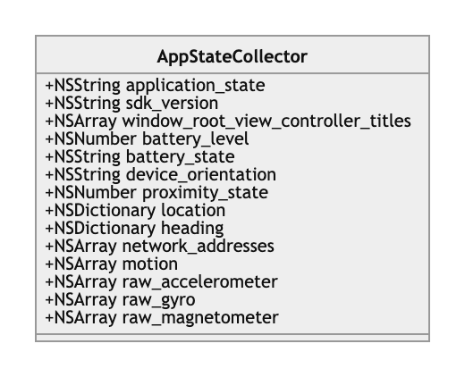
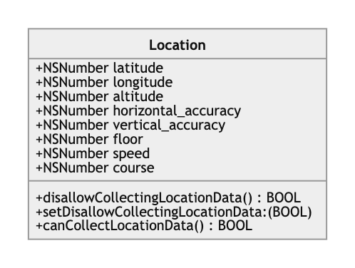
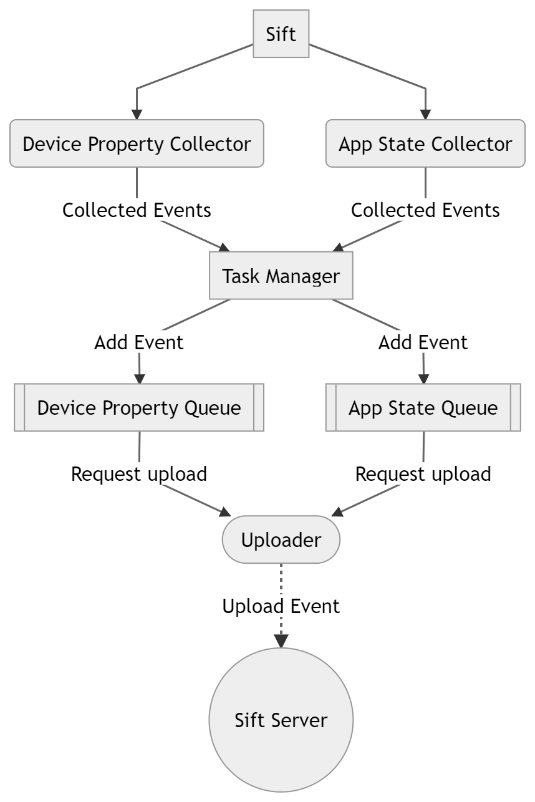

# **Sift iOS SDK**

### Mobile IOS SDK Software Design Documentation

##
### Table of Contents

**[1 Overview](#1-overview)**

**[2 High Level Class Diagram](#2-high-level-class-diagram)**

**[3 Data Models](#3-data-models)**
* [3.1 SiftEvent](#31-siftEvent)
* [3.2 DeviceProperties](#32-deviceProperties)
* [3.3 AppState](#33-appState)
* [3.4 Location](#34-location)

**[4 Modules](#4-modules)**

* [4.1 SIFT](#41-sift)
* [4.2 SIFT EVENT](#42-siftEvent)
* [4.3 SIFT QUEUE](#43-siftQueue) 
* [4.4 SIFT UPLOADER ](#44-siftUploader) 
* [4.5 SIFT DEVICE PROPERTIES ](#45-siftDeviceProperties) 
* [4.6 SIFT APP STATE ](#46-siftAppState) 

**[5 Flow Chart](#5-flow-chart)**

##


## 1 Overview

The [sift-ios](https://github.com/SiftScience/sift-ios)  Mobile SDKs collect and send device information and app life cycle events to Sift. Objective C will be used as the programming language and Xcode will be used as the IDE.  SDK will be supporting iOS 12 as deployment target.

The specific features used are: CoreMotion, BatteryManager, Location, NetworkInterface and TelephonyManager. The SDK uses CoreMotion, BatteryManager, Location and NetworkInterface for collecting AppState details. The Device properties details are collected with the help of TelephonyManager and PackageManager along with Build details. In particular, event collecting, appending and uploading are handled on a separate thread with the help of Executors. The Mobile SDKs allow mobile applications to collect and send device properties and application lifecycle events to Sift. 

A high-level block diagram is shown



1. IOS app loads the SDK with the Sift configurations.
2. The sift SDK will collect and send events to the Sift server when there are events to upload.

This document describes the data models,classes for handling events, and specific flows, respectively.


## 2 High Level Class Diagram




Class Diagram for App State Collector shown below:




## 3 Data Models

The data models is to understand the responsibility (attributes and methods) of each class that should be clearly identified.

### 3.1 SiftEvent

The SiftEvent mainly collects the following information:

- **time** : {type: int64_t}
  - It indicates the time (in ms since the unix epoch) that this event occurred. Default value is now.
- **type** : {type: string}
  - It indicates the mobile event type. Default value is nil.
- **path** : {type: string}
  - It indicates the event path. Default value is nil.
- **userId** : {type: string}
  - It indicates the user ID. If not set, the event queue will use the user ID set in the shared Sift object.
- **installationId** : {type: string}
  - The installation id indicates the 64-bit number (expressed as a hexadecimal string) unique ID to each device.
- **fields** : {type: string}
  - It indicates custom event fields; both key and value must be string typed. Default value is nil.
- **iosDeviceProperties** : {type: DevicePropertiesCollector}
  - The ios device property indicates the device related properties as mentioned in [section 3.2](#32-deviceProperties)
- **iosAppState** : {type: AppStateCollector}
  - The ios app state indicates the application related datas as mentioned in [section 3.3](#33-appState).
- **metrics** : {type: string}
  - It indicates the internal metrics. Default value is nil.

Class diagram of SiftEvent:



###

### 3.2 DeviceProperties

The iOSDeviceProperties collects the following information:

- **app_name** : {type: string}
  - The app name indicates the name of the application in which the sift SDK is used.
- **app_version** : {type: string}
  - The app version indicates the current version name of the application in which the sift SDK is used.
- **sdk_version** : {type: string}
  - The sdk version indicates the current version of the sift SDK that has been used in the application.
- **device_name** : {type: string}
  - It indicates device  name.
- **device_ifv** : {type: string}
    - The identifierForVendor is an alphanumeric string that uniquely identifies a device to the app’s vendor..
- **device_system_name** : {type: string}
  - It indicates the user-visible operating system name string.  Eg: iOS
- **device_system_version** : {type: string}
  - It indicates the user-visible operating system version string. Eg: 13.3
- **mobile_carrier_name** : {type: string}
    - The mobile carrier name indicates the alphabetic name of the current registered network operator.
- **mobile_iso_country_code** : {type: string}
  - It indicates the ISO country code for the user’s cellular service provider..
- **mobile_network_code** : {type: string}
  - It indicates the mobile network code for the user’s cellular service provider.

Class diagram of iOSDeviceProperties:



###

### 3.3 AppState

The iOSAppState collects the following informations:

- **sdk_version** : {type: string}
  - The sdk version indicates the current Sift SDK version which is used.
- **window_root_view_controller_titles** : {type: array}
  - The window root class name indicates the current view controller class name from where the data are collected.
- **battery_level** : {type: number}
  - The current battery level, from 0 to 1.0 and -1.0 if UIDeviceBatteryStateUnknown.
- **battery_state** : {type: string}
  - It indicates the current state of battery. There are following 4 cases:
    - UIDeviceBatteryStateUnknown -> if monitoring disabled.
    - UIDeviceBatteryStateUnplugged -> on battery, discharging
    - UIDeviceBatteryStateCharging -> plugged in, less than 100%
    - UIDeviceBatteryStateFull -> plugged in, at 100%
- **proximity_state** : {type: number}
   - A Boolean value that indicates whether the proximity sensor is close to the user.
- **location** : {type: dictionary}
  - The location consists of collective information of latitude, longitude, accuracy and the time at which data was collected as shown in the [section 3.4](#34-location). (_Have data only if the sift configuration and permissions are enabled_)
- **network_addresses** : {type: array}
  - The network addresses indicate the list of IP addresses of the current device in which the SDK is running. 

Class diagram of iOSAppState:



###

### 3.4 Location

The location consist of the following information:

- **time** : {type: number}
  - It indicates the time at which the location data was collected.
- **latitude** : {type: number}
  - Which indicates the latitude of the collected location.
- **longitude** : {type: number}
  - Which indicates the longitude of the collected location.
- **altitude** : {type: number}
  - Which indicates the altitude, measured in meters.
- **horizontal_accuracy** : {type: number}
  - Indicates the radius of uncertainty for the location, measured in meters.
- **vertical_accuracy** : {type: number}
  - Indicates the accuracy of the altitude value, measured in meters.
- **floor** : {type: number}
  - Indicates the logical floor of the building in which the user is located..
- **speed** : {type: number}
  - Indicates the accuracy of the speed value, measured in meters per second.
- **course** : {type: number}
  - Indicates the accuracy of the course value, measured in degrees.

Class diagram for Location:



## 4 Modules

The SDK also has a number of classes that deal with event collecting, saving and uploading to Sift server.

### 4.1 Sift

This is a utility class of the sift client library which handles the application-level code for interacting with the framework for collecting, saving and uploading events. This class sets up and holds references to the event queues and event collectors, including AppStateCollector and DevicePropertiesCollector.

Configuring of the Sift iOS SDK requires passing in your account id and beacon key.
For Objective C:
```Objective C
Sift *sift = [Sift sharedInstance];

// At minimum, you should configure these two
[sift setAccountId:@"YOUR_ACCOUNT_ID"];
[sift setBeaconKey:@"YOUR_JAVASCRIPT_SNIPPET_KEY"];
```
For Swift:
```Swift
let sift = Sift.sharedInstance
sift().accountId = "YOUR_ACCOUNT_ID"
sift().beaconKey = "YOUR_JAVASCRIPT_SNIPPET_KEY"
```

Sift class provide a builder class to initialize the configuration data and variable to set value:
- **(instancetype)sharedInstance**
  - It return the shared instance of Sift to initialise the RootDirPath value:
- **initWithRootDirPath**(_rootDirPath_)
  - **_rootDirPath_** : {type: string}
    - Set rootDirPath value and serverUrlFormat value that is the location of the API endpoint; defaults to @"https://api3.siftscience.com/v3/accounts/%@/mobile_events"
- **accountId** : {type: string}
  - Your account ID; defaults to nil.
- **beaconKey** : {type: string}
  - Your beacon key; defaults to nil.
- **userId** : {type: string}
  - Your User ID; defaults to nil.
- **disallowCollectingLocationData** : {type: boolean}
  - Whether to allow location collection; defaults to false.

This class mainly handles the following task:
- Setting Sift Configuration.
- Setting user Id.
- Appends the collected event to the App State queue and Device Properties queue.
- Collect Location and Device Motion Data.

Following are the static API to interact with SDK:
- **setAccountId**(_accountId_)
    - It will set the accountId inside the sift instance.
- **setBeaconKey**(_beaconKey_)
    - It will set the beaconKey inside the sift instance..
- **setUserId**(_userId_)
  - It will set the userId inside the sift instance.
- **unsetUserId**()
  - Which removes any current useId to nil
- **setDisallowCollectingLocationData**(_disallowCollectingLocationData_)
  - Whether to allow location collection; defaults to false.
- **upload**()
  - It will call the upload method with force param as NO.
- **upload**(_force_)
  - It will upload the collects events to Sift Server. If force is YES, then won't wait for queue.readyForUpload to be true.
- **pause**()
  - It will pause collecting and uploading events to Sift Server
- **resume**()
  - It will resume collecting and uploading events to Sift Server

### 4.2 SiftEvent

This class is the implementation of manage Sift Events that collected from app state collector and device properties collector. 
SiftEvent mainly handles the following task:
- Collect the events in proper format in dictionary and do the sanity check. So that it will easier to encode and decode the events.
- Appends the collected event to the list request.

This class have the following methods:

- **eventWithType**(_type_, _path_, _fields_)
  - It will the create the event with specified type.
- **isEssentiallyEqualTo**(_event_)
  - It compare event contents except time. Its return boolean value.
- **listRequest**(_events_)
  - Create a JSON-encoded list request object. It return as NSData.
- **appendDevicePropertiesEvent**(_event_)
  - Which invokes the task manager to execute the append task with Device Properties queue identifier and provided event.
- **sanityCheck**()
  - it return YES if event contents make sense.

### 4.3 SiftQueue

This class is for holding events until they are ready for upload to the sift server. Whenever an event is collected and tries to add either in the App State or Device Properties queue, it will append and upload depending on the queue's batching policy. The queue's batching policy is controlled by the queue configuration and state of the queue.

The queue configuration depends on the following factors:

- **acceptSameEventAfter** : {type: long}
  - Time after which an event that is basically the same as the most recently appended event can be appended again.
- **uploadWhenMoreThan** : {type: int}
  - Max queue depth before flush and upload request.
- **uploadWhenOlderThan** : {type: long}
  - Max queue age before flush and upload request.

Which can be initialized through the queue config class, which provide the following methods:

- withAcceptSameEventAfter(_acceptSameEventAfter_): {type: long}
- withUploadWhenMoreThan(_uploadWhenMoreThan_): {type: int}
- withUploadWhenOlderThan(_uploadWhenOlderThan_): {type: long}

```Objective C
 static const SiftQueueConfig SFIosDevicePropertiesCollectorQueueConfig = {
     .uploadWhenMoreThan = 0,
     .acceptSameEventAfter = 3600  // 1 hour
 };
```
The DeviceProperties queue is configured as:

- _acceptSameEventAfter: **3600**_ // 1 hour
- _uploadWhenMoreThan: **0**_

The AppState queue is configured as:

- _uploadWhenMoreThan: **32**_ // Unit: number of events.
- _uploadWhenOlderThan: **60**_  // 1 minute.

This class holds the state of the queue with the following attributes:

- **identifier** : {type: string}
  - The identifier is the key for the queue.
- **queue** : {type: NSMutableArray}
  - The list of collected events as of now to be uploaded depending on the policy.
- **config** : {type: SiftQueueConfig}
  - The configuration of the queue which decides the batching policy.
- **lastEvent** : {type: SiftEvent}
  - The recent event added to the queue.
- **lastUploadTimestamp:** {type: SFTimestamp}
  - The time at which recent upload was carried on.
- **archivePath:** {type: string}
  - The time at which recent upload was carried on.

This class have the following methods:

- **archive**()
  - This method write the queue content to specified path in NSMutableDictionary format. This dictionary will have queue, lastEvent and lastUploadTimestamp detail.
- **unarchive**()
  - This method will unarchive the content from the given path. And also assign values to queue, lastEvent and lastUploadTimestamp from unarchived dictionary detail.
- **append**(_event_)
  - Where _event_ is the collected event to be appended and uploaded depending on the queue batching policies.
- **transfer**()
  - It will transfer ownership of the queue of events to the caller.
- **readyForUpload**()
  - The queue uploading policy is based on:
    - When queue is full -> `_config.uploadWhenMoreThan >= 0 && _queue.count > _config.uploadWhenMoreThan`
    - When queue is old -> ` _config.uploadWhenOlderThan > 0 && _queue.count > 0 && now > _lastUploadTimestamp + _config.uploadWhenOlderThan * 1000`
- **requestUpload**()
  - This method will the upload method from sift class which is used at the time of uploading events, whenever the collected events are ready for upload 

### 4.4 SiftUploader
This module upload the events to the Sift Server. It contains App state events and device properties events.

This class have the following methods:
- **upload**(_events_)
  -  Add the events to batches. If app is in background ithen archive the data. Later it will doUpload method which will upload the collects events to Sift Server.
- **doUpload**()
  -  This method will the upload events to the Sift server .
- **unarchive**()
  - This method will unarchive the content from the given path. And also assign values to batches and numRejects  from unarchived dictionary detail.
- **upload**(_events_)
  - It will upload the collects events to Sift Server.
- **pause**()
  - It will pause collecting and uploading events to Sift Server
- **resume**()
  - It will resume collecting and uploading events to Sift Server
  
  ### 4.5 SiftDeviceProperties

  This module collect the device proerties details and assign it to the sift event.

  This class have the following methods:
  - **collect**()
    -  Collect device properties through its own queue.
 
 The DeviceProperties queue is configured as:
 - _acceptSameEventAfter: **3600**_ // 1 hour
 - _uploadWhenMoreThan: **0**_

 This class holds the device related properties with the following attributes as mentioned in [section 3.2](#32-deviceProperties).

  ### 4.6 SiftAppState
  This module collect the app state details and assign it to the sift event. App state collects the location, haeding, device motion, accelerometer data, gyro data amd magnetometer data details.

   This class have the following methods:
   - **archive**()
     - This method write the queue content to specified path in NSMutableDictionary format. This dictionary will have bucket and lastCollectedAt details.
   - **unarchive**()
     - This method will unarchive the content from the given path. And also assign values to bucket and lastCollectedAt from unarchived dictionary detail.
   - **updateDeviceMotion**(_data_)
     -  This method will send the CMDeviceMotion data you have got.
   - **updateAccelerometerData**(_data_)
     -  This method will send the CMAccelerometerData data you have got.
   - **updateGyroData**(_data_)
     -  This method will send the CMGyroData data you have got.
   - **updateMagnetometerData**(_data_)
     -  This method will send the CMMagnetometerData data you have got.
   - **requestCollectionWithTitle**(_title_)
     -  Request to collect app state and this mrequest might be ignored due to rate limiting.
   - **checkAndCollectWhenNoneRecently**(_now_)
     -  This method will collect app state if there was no collection in the last SF_MAX_COLLECTION_PERIOD of time and app is active.
   - **collectWithTitle**(_title_, _now_)
     -  This method will collect app state with title. Here `title` is String and `now` is SFTimestamp.
   - **canCollectLocationData**()
     -  This method will return YES if can collect Location data.
   - **disallowCollectingLocationData**()
     -  This method will return disallowCollectingLocationData Bool value.
   - **allowUsingMotionSensors**()
     - If you intend to use motion sensors occasionally, please call the following methods to send us motion data.
         
  The AppState queue is configured as:
  - _uploadWhenMoreThan: **32**_ // Unit: number of events.
  - _uploadWhenOlderThan: **60**_  // 1 minute.

This class holds the application related datas with the following attributes as mentioned in [section 3.3](#33-appState).

## 5 Flow Chart




