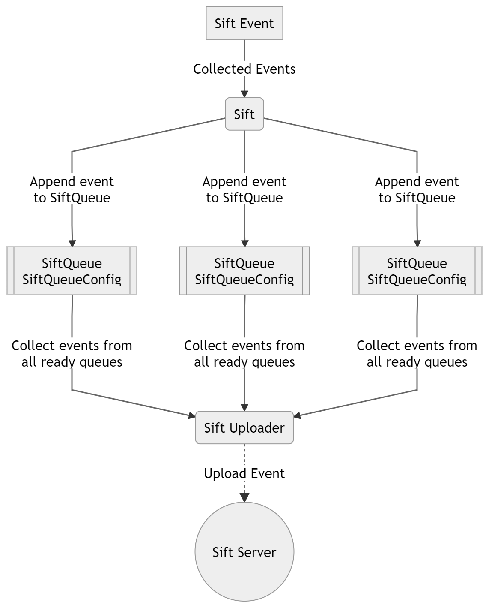
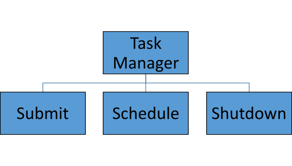

# **Sift iOS SDK**

### Propose Technical Design Documentation

##
### Table of Contents

**[1 Overview](#1-overview)**

**[2 Current Data Flow Diagram](#2-current-data-flow-diagram)**

**[3 Proposed Data Flow Chart](#3-proposed-data-flow-chart)**

**[4 Thread Management](#4-thread-management)**

##

## 1 Overview

The [sift-ios](https://github.com/SiftScience/sift-ios)  Mobile SDKs collect and send device information and app life cycle events to Sift. Objective C will be used as the programming language and Xcode will be used as the IDE.  SDK will be supporting iOS 12 as deployment target.

The specific features used are: CoreMotion, BatteryManager, Location, NetworkInterface and TelephonyManager. The SDK uses CoreMotion, BatteryManager, Location and NetworkInterface for collecting AppState details. The Device properties details are collected with the help of TelephonyManager and PackageManager along with Build details. In particular, event collecting, appending and uploading are handled on a separate thread with the help of Executors. The Mobile SDKs allow mobile applications to collect and send device properties and application lifecycle events to Sift. 

A high-level block diagram is shown

1. IOS app loads the SDK with the Sift configurations.
2. The sift SDK will collect and send events to the Sift server when there are events to upload.

## 2 Current Data Flow Diagram

Current overview of the Sift module is shown below:

1. The unit of data i.e. SiftEvent object is created  and send it to the shared Sift Object.
2. The Sift object will append that SiftEvent to the SiftQueue you specify.
3.  When the events of a SiftQueue is ready for uploading (as specified in SiftQueueConfig), that SiftQueue will notify SiftUploader, which will then collect events from all queues of which events are ready for uploading, and upload events in one batch.

To have better batching results, you should create queues based on your batching requirements rather than solely based on event types. (There is a default queue, which might be all you need.)

## 3 Proposed Data Flow Chart

After comparing with Sift android SDK, here the proposed data flow chart below :

1. Sift Events will have two types for collectors i.e, Device property collector and App state collector.
2. There will be common task manager which will collect the events from both collectors.
3. Task Manager will assign the each events to its corresponding queues.
4. When the queue is ready, it will upload the event to sift server separately and there will be no dependency of other queue.

## 4 Thread Management

Current thread management are in a nested dispatch format. This means, even if the main thread (the UI thread) is busy updating the screen, the app can still be doing more computations in the background without the need for any context switch. Having multiple asynchronous tasks and wait until all are completed. The most simple one is utilising DispatchGroup or OperationQueue. You can submit the tasks to some sort of "executer" which controls how many tasks run concurrently (match like OperationQueue and async Operations).

Following diagram is Task Manager's:

1. SUBMIT: Add the collected task to queue.
2. SCHEDULE: Uploading process and also will be tracking on delay time.
3. SHUTDOWN: Shutdown called on page dismiss. It will terminate all the ongoing tasks.

